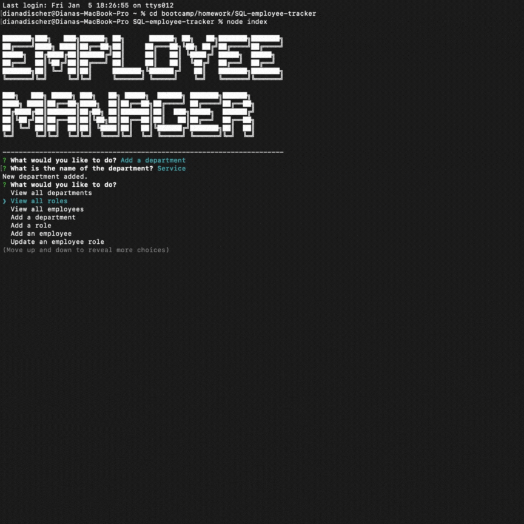

# SQL-employee-tracker 

## Description
This is a command line CMS that manage's a company's database using Node, MySQL, and inquirer. It organizes the company's departments, roles, and employees, and allows them to view and alter them.

## Table of Contents
*[Installation](#installation)  
*[Usage](#usage)  
*[Contributors](#contributors)  
*[Tests](#tests)  
*[Questions](#questions) 

## Installation
To use this project a user would download the file package, open the folder in their terminal, install the packages, and run the index script file using node.    

## Usage
When the user starts the script they are asked what they would like to do, and are presented with options to select from. They can view, add, and alter the database. After they've selected an option, the program will either display what the user asked to see or ask follow up questions and add to or alter the database. Then it will restart the initial prompt. If the user is done using the app, they can select quit, and the app will exit out.
    
## License
The license for this project is: MIT.

## Contributors
Project concept and guidelines were provided by the University of Pennsylvania in collaboration with EdX.
    
## Tests 
A user can test how the program responds to null inputs, and to run the different prompts to make sure they match and are altered correctly by cross-checking how the table apear when accessing the database through SQL.
    
## Questions
[Link to GitHub profile](github.com/dianamariedischer)

If you have more questions you can get in touch at dianamariedischer@gmail.com

